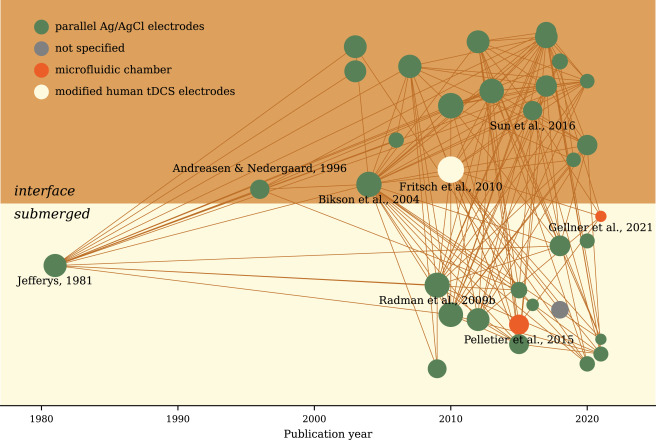

# kirsche

Kirsche is a python package to build up connections between papers.

## How to Use

- Install the package: `pip install kirsche`
- In your command line, run `kirsche --help` to see possible commands.

## Demo

[Lu H, Shaner S, Otte E, Asplund M, Vlachos A. A microfluidic perspective on conventional in vitro transcranial direct current stimulation methods. J Neurosci Methods. 2022; 109761. doi:10.1016/j.jneumeth.2022.109761](https://www.sciencedirect.com/science/article/pii/S0165027022002874)

## Caveats

### About SemanticScholar API

We are using [SemanticScholar API](https://www.semanticscholar.org/product/api) to get the paper metadata. The API has some rate limits ([100 requests per 5 minutes](https://www.semanticscholar.org/product/api)).

A possible workaround for large number of papers is to split them into batches.

Todo:
- [ ] Use API keys from SemanticScholar.
