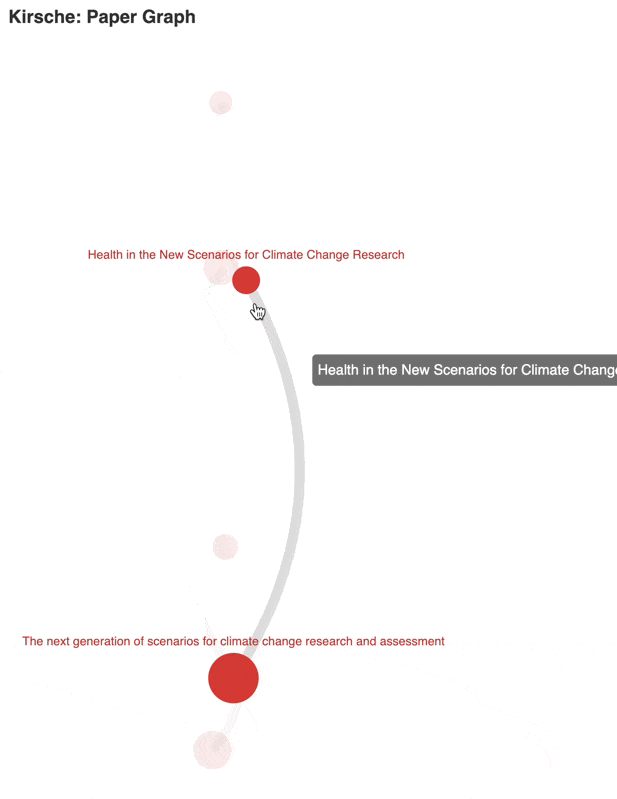
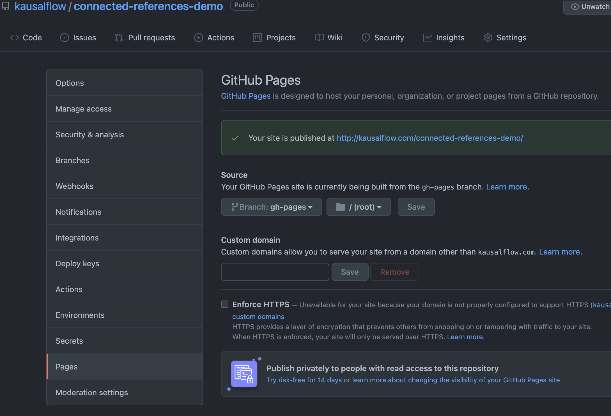

# Use in GitHub Actions

[GitHub Actions](https://github.com/features/actions) is a great to to automate your workflows.

!!! info "Paperpile"
    [Paperpile](https://paperpile.com/) can automatically backup bib files in git repositories. Using GitHub Actions, we can perform some magic on our paperpile backups.


## Setup Actions to Visualize bib Files

!!! tip "Demo Repository"
    We have setup a demo repository here: [kausalflow/connected-references-demo](https://github.com/kausalflow/connected-references-demo).


The following is a demo.


=== "Result"

    The following files will be created

    ```
    data
    ├── connections-climate_change
    │   ├── 12868807.json
    │   ├── 128770297.json
    │   ├── 14298480.json
    │   ├── 154857890.json
    │   ├── 1614769.json
    │   └── 27573.json
    └── visualizations
        └── climate_change.html
    ```

    And a new branch (`gh-pages`) will be created using the content inside `data/visualizations`. Set up your github pages using this branch to see the website.

    

=== "GitHub Actions Configurations"

    Suppose your bib file is located at `references/climate_change.bib` in your repo.

    Create a file in your repo: `.github/workflows/visualize_climate_change.yaml` and fill it with the following.

    ```yaml
    name: Visualize Climate Change Papers
    on:
        push:
            branches:
            - main
        schedule:
            - cron:  '5 7/5 * * *'
        workflow_dispatch:
            inputs:
            name:
                description: 'Hit it now'
                required: false
                default: 'I Just wanna do it'

    jobs:
        deploy:
            runs-on: ubuntu-latest
            steps:
            - name: Checkout current repo
                uses: actions/checkout@v2
            - name: Get current directory and files
                run: |
                pwd
                ls
            - uses: actions/setup-python@v2
                with:
                python-version: '3.7' # Version range or exact version of a Python version to use, using SemVer's version range syntax
                architecture: 'x64' # optional x64 or x86. Defaults to x64 if not specified
            - name: Install Python Requirements
                run: |
                python --version
                pip install kirsche
            - name: Download Records
                run: |
                kirsche connections -sb references/climate_change.bib -c data/connections-climate_change/
                kirsche visualization -sc data/connections-climate_change/ -th data/visualizations/climate_change.html
                git config --local user.email "action@github.com"
                git config --local user.name "GitHub Action"
                git pull
                git status
                git add .
                git commit -m "Update Meta and Visualize" || echo "Nothing to update"
                git pull
                git status
            - name: Push changes
                uses: ad-m/github-push-action@v0.6.0
                with:
                branch: main
                github_token: ${{ secrets.GITHUB_TOKEN }}
            - name: Deploy Visualizations
                uses: peaceiris/actions-gh-pages@v3
                with:
                github_token: ${{ secrets.GITHUB_TOKEN }}
                publish_dir: ./data/visualizations/
                publish_branch: gh-pages
    ```


??? tip "Setup GitHub Pages"

    


Using this GitHub Actions, the visualization will be updated whenever new references are added to the bib file.


!!! warning "Limitations"

    Since SemanticScholar API only allows 100 records per 5 min, it is not practical to visualize millions of papers. But don't worry about the limitations, we have implemented some mechanism to stop the query at the right moment. Since all meta files are saved, the scheduled runs will download records that are left from the previous runs.

    Just in case, here is the setting for the schedules:

    ```yaml
          schedule:
            - cron:  '5 7/5 * * *'
    ```
